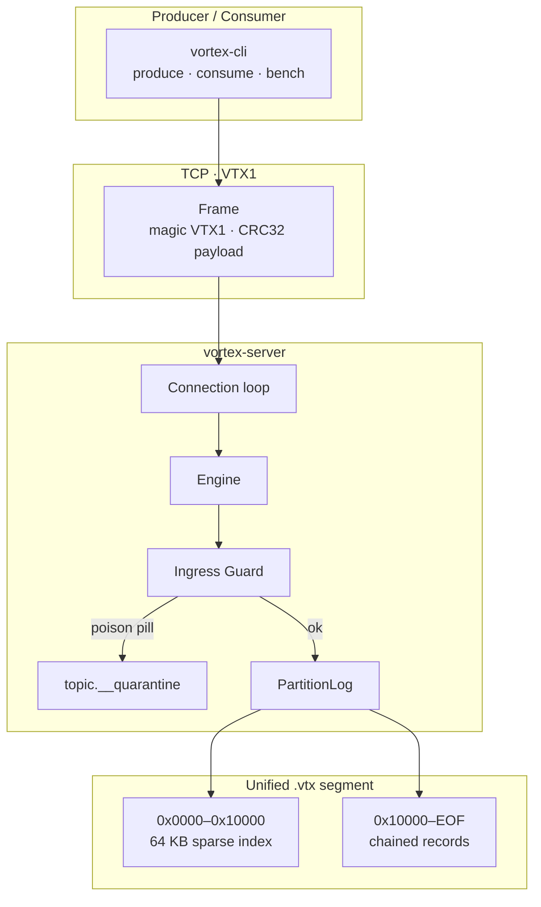
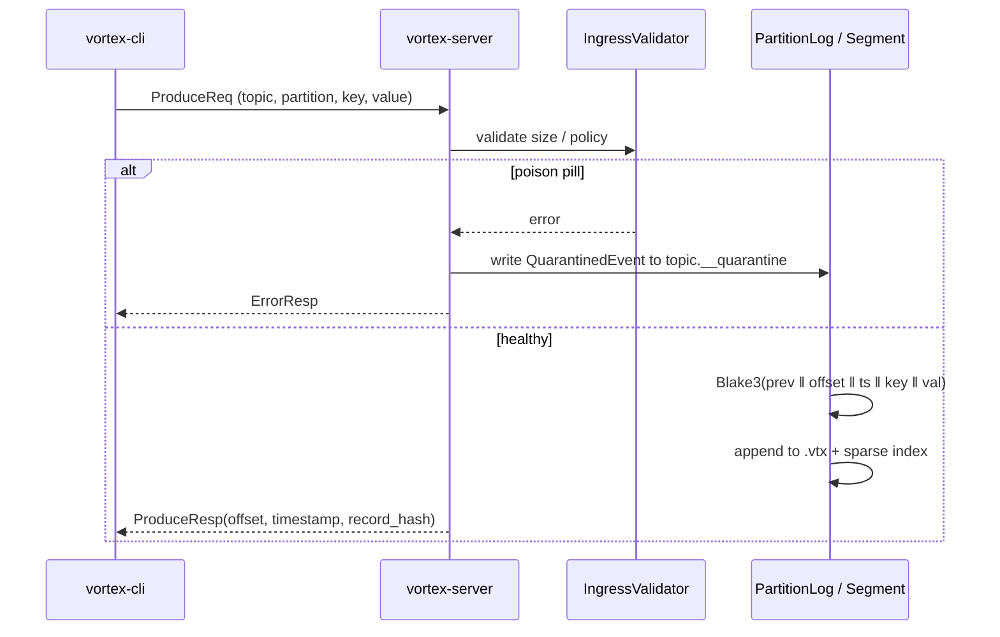
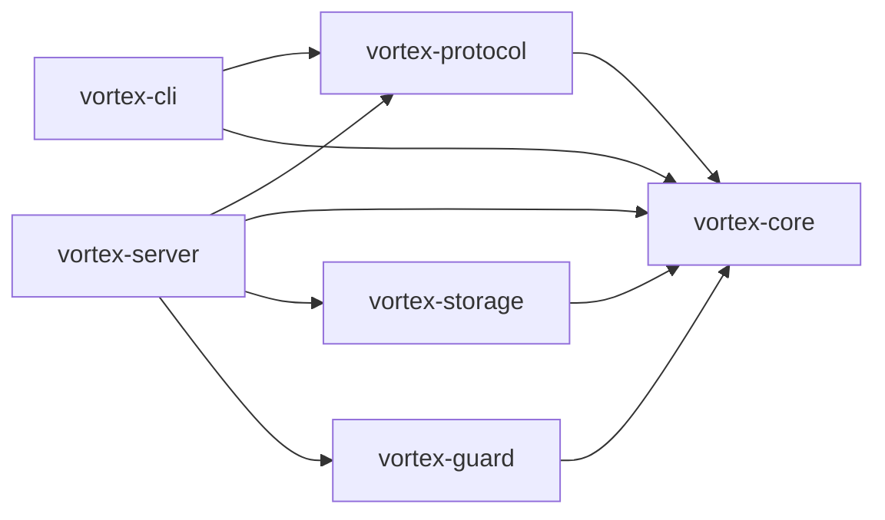

<div align="center">

```
 ██╗   ██╗ ██████╗ ██████╗ ████████╗███████╗██╗  ██╗
 ██║   ██║██╔═══██╗██╔══██╗╚══██╔══╝██╔════╝╚██╗██╔╝
 ██║   ██║██║   ██║██████╔╝   ██║   █████╗   ╚███╔╝
 ╚██╗ ██╔╝██║   ██║██╔══██╗   ██║   ██╔══╝   ██╔██╗
  ╚████╔╝ ╚██████╔╝██║  ██║   ██║   ███████╗██╔╝ ██╗
   ╚═══╝   ╚═════╝ ╚═╝  ╚═╝   ╚═╝   ╚══════╝╚═╝  ╚═╝
```

# Vortex

**Self-defending, cryptographically verifiable event streaming — engineered in Rust.**

A next-generation broker that replaces Kafka’s JVM + three-file segments with a **2.5 MB** binary, **~10 MB RAM**, unified `.vtx` storage, Blake3 lineage, and an ingress immune system that quarantines poison pills before they ever reach consumers.

[Quick Start](#-quick-start) · [Why Vortex](#-why-vortex) · [Architecture](#-architecture) · [CLI Playground](#-cli-playground) · [Protocol](#-vtx1-protocol) · [Benchmarks](#-benchmarks) · [Crates](#-crate-map)

<br />


</div>

---

## Jump in

| I want to… | Go here |
| :--- | :--- |
| Run a broker in 60 seconds | [Quick Start](#-quick-start) |
| See how it beats Kafka on size, RAM, and tail latency | [Why Vortex](#-why-vortex) |
| Trace a produce through Guard → Engine → `.vtx` | [Architecture](#-architecture) |
| Copy-paste produce / consume / bench | [CLI Playground](#-cli-playground) |
| Decode a `VTX1` frame | [Protocol](#-vtx1-protocol) |
| Read the full numbers | [BENCHMARKS.md](BENCHMARKS.md) |

---

## Why Vortex

Kafka was designed for a different era: JVM heaps, GC pauses, and three files per segment. Vortex is a single-process Rust broker with a custom binary protocol (`VTX1`), hardware CRC32, and a Blake3 hash chain that makes every record a proof of what came before it.

| | Apache Kafka | **Vortex** |
| :--- | :--- | :--- |
| Runtime | Java / JVM | **Rust — zero GC** |
| Broker RAM | 1–4 GB | **~9.9 MB RSS under 100k msgs** |
| Tail latency (p99) | GC spikes to tens of ms | **40–58 µs** (loopback, sync producer) |
| Binary | ~120 MB JARs + JVM | **2.5 MB** `vortex-server` |
| Storage | `.log` + `.index` + `.timeindex` | **One `.vtx` file** (64 KB sparse index + records) |
| Integrity | CRC32 | **CRC32 + Blake3 Merkle chain** |
| Poison pills | Crash consumer fleets | **Ingress Guard → `__quarantine`** |
| Cold start | 10–30 s | **< 10 ms** |

<details>
<summary><b>Click: what “cryptographic lineage” actually means</b></summary>

<br />

Every record stores `prev_hash` and `record_hash`. The hash is:

```
Blake3(prev_hash ‖ offset ‖ timestamp ‖ key_len ‖ key ‖ val_len ‖ val)
```

Partition 0 of topic `payments` starts from a keyed genesis hash (`VORTEX_STREAM_GENESIS_SALT_V1.00` + topic + partition). Tamper one byte in the middle of a segment and verification fails at that offset — not “sometime later when CRC happens to disagree.”

On produce, the broker returns the new Blake3 digest so clients can audit without a full scan.

</details>

<details>
<summary><b>Click: what the Ingress Immune System does</b></summary>

<br />

`vortex-guard` inspects every produce **before** it touches storage:

1. **Size cap** — default 10 MB; oversized payloads are poison pills.
2. **Optional empty-payload reject.**
3. **Optional UTF-8 JSON structural check** (object/array root + `serde_json` parse).

Rejected events are serialized as a `QuarantinedEvent` (topic, reason, key hex, 128-byte preview) and routed to `<topic>.__quarantine`. Healthy consumers never see the malformed wire.

</details>

---

## Architecture



### Path of a produce



### Dual-region `.vtx` layout

```
┌─────────────────────────────────────────────────────────────┐
│  HEADER + SPARSE INDEX   64 KB  (HEADER_INDEX_REGION_SIZE)  │
│  magic VTX1 · version · base_offset · genesis_hash · index  │
├─────────────────────────────────────────────────────────────┤
│  RECORD REGION           mmap’d from 0x10000 → EOF          │
│  [len][crc32][offset][ts][prev_hash][hash][key][value] …    │
│  Index checkpoint every 64 KB of payload  →  O(log n) seek  │
└─────────────────────────────────────────────────────────────┘
```

Record on-disk header is **96 bytes** before key/value (`RECORD_HEADER_SIZE`).

---

## Quick Start

**Requires** Rust 1.80+ (`rustc`).

```bash
git clone https://github.com/Ujjwal0207/Vortex.git
cd Vortex
cargo build --release
```

Binaries land in `./target/release/`:

| Binary | Typical size | Role |
| :--- | :--- | :--- |
| `vortex-server` | ~2.5 MB | Broker |
| `vortex-cli` | ~1.5 MB | Admin, produce, consume, bench |

### 1. Start the broker

```bash
./target/release/vortex-server --host 127.0.0.1 --port 9092 --data-dir ./data/vortex
```

### 2. Create a topic, produce, consume

```bash
BROKER=127.0.0.1:9092
CLI=./target/release/vortex-cli

$CLI --broker $BROKER create-topic --topic payments --partitions 1

$CLI --broker $BROKER produce \
  --topic payments \
  --key user-409 \
  --message '{"amount": 499.00, "status": "APPROVED"}'

$CLI --broker $BROKER consume --topic payments --from-offset 0 --limit 100
```

Produce prints **offset, timestamp, and Blake3**. Consume prints a table of offset / key / hash prefix / value.

### 3. Integrity + throughput bench

```bash
./target/release/vortex-cli bench --topic bench-stream --messages 50000 --size 512
```

---

## CLI Playground

Default broker is `127.0.0.1:9092`. Override with `--broker host:port`.

<details open>
<summary><code>create-topic</code> — spin up partitions</summary>

```bash
vortex-cli create-topic --topic payments --partitions 1
```

| Flag | Default | Meaning |
| :--- | :--- | :--- |
| `--topic` / `-t` | required | Topic name |
| `--partitions` / `-p` | `1` | Partition count |

</details>

<details>
<summary><code>produce</code> — append one event, get a hash back</summary>

```bash
vortex-cli produce --topic payments --partition 0 --key user-409 --message '{"ok":true}'
```

| Flag | Default | Meaning |
| :--- | :--- | :--- |
| `--topic` / `-t` | required | Topic |
| `--partition` / `-p` | `0` | Partition |
| `--key` / `-k` | none | Optional key |
| `--message` / `-m` | required | Payload bytes (UTF-8 in the CLI) |

</details>

<details>
<summary><code>consume</code> — fetch from an offset</summary>

```bash
vortex-cli consume --topic payments --partition 0 --from-offset 0 --limit 100
```

The CLI requests up to **1 MB** per fetch, then prints at most `--limit` records.

</details>

<details>
<summary><code>bench</code> — load + cryptographic audit</summary>

```bash
vortex-cli bench --topic bench-stream --messages 10000 --size 256
```

Creates the topic if needed, sync-produces N payloads, then verifies the Blake3 chain on the stored records.

</details>

---

## VTX1 Protocol

Wire magic is `0x56545831` (`VTX1`), version `1`. Frames are 18-byte headers plus CRC32’d payload.

```
┌────────┬─────────┬──────────┬────────┬─────────────┬────────┬──────────┐
│ magic  │ version │ msg_type │ req_id │ payload_len │ crc32  │ payload  │
│ 4B     │ 1B      │ 1B       │ 4B     │ 4B          │ 4B     │ N        │
└────────┴─────────┴──────────┴────────┴─────────────┴────────┴──────────┘
```

| `msg_type` | Name | Direction |
| :---: | :--- | :--- |
| 1 | `ProduceReq` | client → broker |
| 2 | `ProduceResp` | offset + ts + 32-byte hash |
| 3 | `FetchReq` | topic, partition, start offset, max bytes |
| 4 | `FetchResp` | encoded `Record`s |
| 5 / 6 | `CreateTopicReq` / `Resp` | partition count |
| 7 / 8 | `MetadataReq` / `Resp` | reserved on the wire |
| 9 | `ErrorResp` | code + message |

<details>
<summary><b>Click: ProduceResp layout</b></summary>

```
offset: u64 | timestamp: u64 | record_hash: [u8; 32]
```

</details>

---

## Crate map

Workspace members — click a crate in the graph (GitHub) or open the path.



| Crate | Path | Responsibility |
| :--- | :--- | :--- |
| **vortex-core** | `crates/vortex-core` | `Record` encode/decode, Blake3 lineage, CRC32, errors |
| **vortex-storage** | `crates/vortex-storage` | `.vtx` segments, mmap, sparse index, `PartitionLog` |
| **vortex-guard** | `crates/vortex-guard` | Ingress validation + quarantine events |
| **vortex-protocol** | `crates/vortex-protocol` | `VTX1` frames and request/response codecs |
| **vortex-server** | `crates/vortex-server` | Tokio TCP broker + engine |
| **vortex-cli** | `crates/vortex-cli` | Human CLI + bench harness |

---

## Benchmarks

Measured on **Apple Silicon**, `rustc` release, TCP loopback, **single synchronous producer**. Full tables, mega-payload run, `kill -9` recovery, and Kafka head-to-head: **[BENCHMARKS.md](BENCHMARKS.md)**.

| Run | Messages | Size | Throughput | p50 | p99 | Audit |
| :--- | ---: | ---: | ---: | ---: | ---: | :--- |
| Standard | 10,000 | 256 B | 39,704 msgs/s | 22 µs | 58 µs | 100% verified in 18 ms |
| Scale | 100,000 | 512 B | 43,561 msgs/s | 22 µs | 40 µs | 100% verified in 229 ms |
| Mega | 100 | 512 KB | 872 MB/s | 540 µs | 1.08 ms | 100% verified |

After 100k messages / ~100 MB data: **RSS 9.9 MB**. Hard `SIGKILL` mid-write recovered the index and served through offset `99999` with no duplicate keys.

> These are loopback, single-pipeline numbers — not a clustered Kafka bake-off. They show what the storage + hash path costs when the JVM is out of the way.

---

## Project status

Vortex is **v0.1.0** — a working single-node broker with durable `.vtx` logs, cryptographic chaining, and a poison-pill quarantine path. Clustering, consumer groups, and replication are not in this tree yet.

```bash
cargo test --workspace
```

---

<div align="center">

**Apache-2.0** · Built in Rust · Hash-chained by default

`cargo build --release && ./target/release/vortex-server`

</div>
