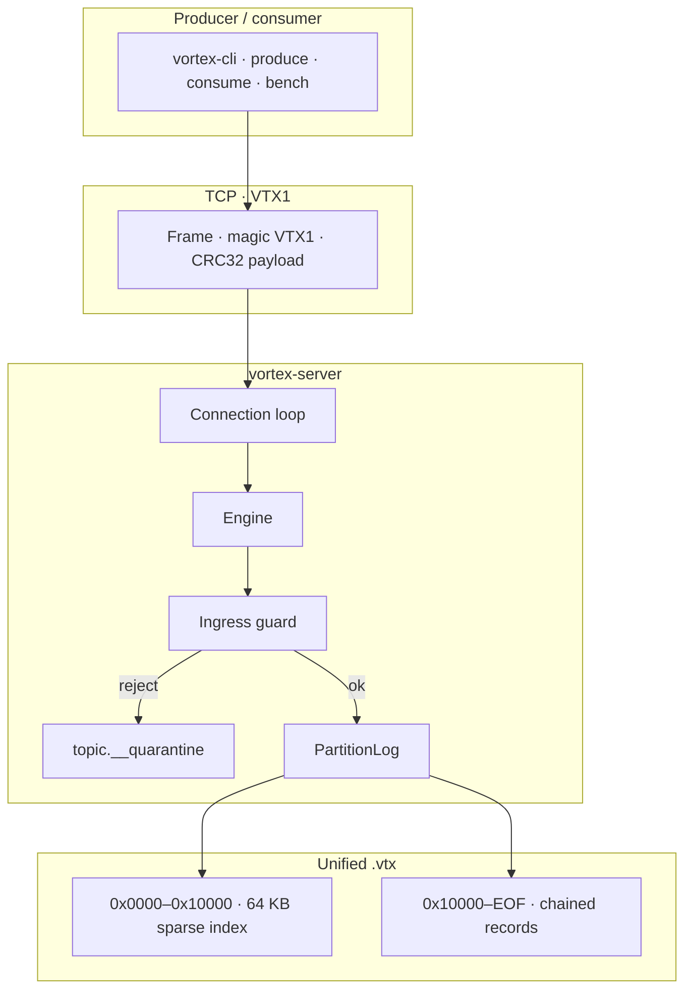
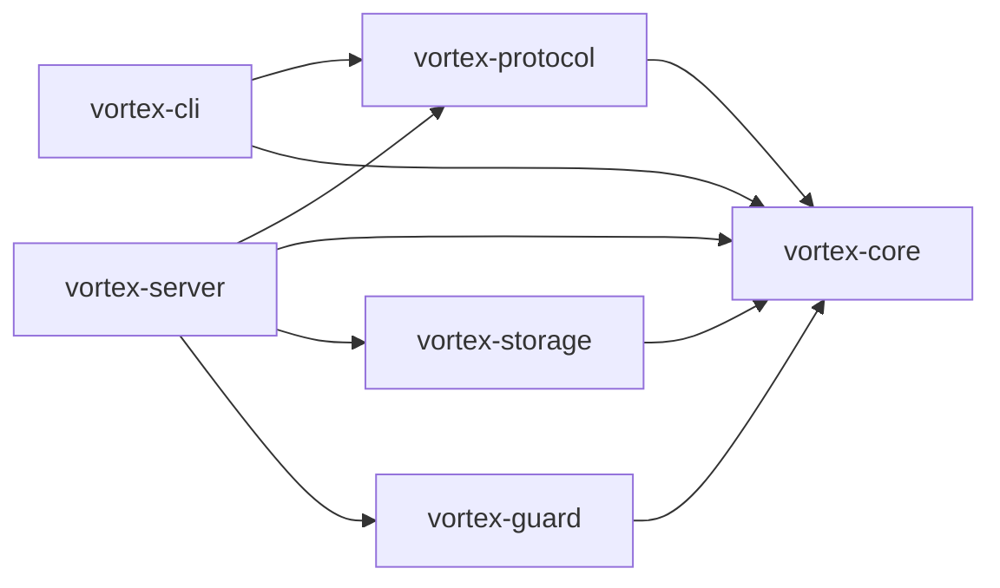

<div align="center">

```
 ██╗   ██╗ ██████╗ ██████╗ ████████╗███████╗██╗  ██╗
 ██║   ██║██╔═══██╗██╔══██╗╚══██╔══╝██╔════╝╚██╗██╔╝
 ██║   ██║██║   ██║██████╔╝   ██║   █████╗   ╚███╔╝
 ╚██╗ ██╔╝██║   ██║██╔══██╗   ██║   ██╔══╝   ██╔██╗
  ╚████╔╝ ╚██████╔╝██║  ██║   ██║   ███████╗██╔╝ ██╗
   ╚═══╝   ╚═════╝ ╚═╝  ╚═╝   ╚═╝   ╚══════╝╚═╝  ╚═╝
```

# Vortex

**Self-defending, hash-chained event streaming — written in Rust.**

A single-node broker with a custom TCP protocol (`VTX1`), one `.vtx` file per segment, CRC32 + Blake3 record lineage, and an ingress guard that quarantines junk before it hits healthy consumers.

v0.1.0 is a **standalone** engine. Clustering, consumer groups, and Kafka-compatible clients are on the [roadmap](#-roadmap) — they are not in this binary yet.

[Quick Start](#-quick-start) · [Highlights](#-highlights) · [Architecture](#-architecture) · [CLI Playground](#-cli-playground) · [Protocol](#-vtx1-protocol) · [Benchmarks](#-benchmarks) · [Roadmap](#-roadmap)

<br/>


</div>

---

## Jump in

| I want to… | Go here |
| :--- | :--- |
| Run a broker in a minute | [Quick Start](#-quick-start) |
| See measured throughput, latency, RAM, binary size | [Benchmarks](#-benchmarks) |
| Trace produce → guard → `.vtx` | [Architecture](#-architecture) |
| Copy-paste produce / consume / bench | [CLI Playground](#-cli-playground) |
| Decode a `VTX1` frame | [Protocol](#-vtx1-protocol) |
| Full lab notes | [BENCHMARKS.md](BENCHMARKS.md) |

---

## Highlights

Measured on **Apple Silicon**, `rustc 1.98.1` `--release`, TCP **loopback**, **one sync produce per round-trip**.

| | This repo (v0.1.0) |
| :--- | :--- |
| **Runtime** | Rust, no JVM / no GC |
| **Broker binary** | **~2.5 MB** |
| **CLI** | **~1.5 MB** |
| **RSS** (100k msgs, ~100 MB data) | **9.9 MB** |
| **Cold start** | **< 10 ms** |
| **p50 / p99** (256–512 B messages) | **21–22 µs / 40–58 µs** |
| **50k × 512 B ingest** | **42,342 msgs/s** · 24.55 MB/s · **1.18 s** |
| **100k × 512 B ingest** | **43,561 msgs/s** · p99 **40 µs** |
| **512 KiB payloads** | **871.90 MB/s** |
| **Storage** | **One `.vtx`** (64 KB sparse index + records) |
| **Integrity** | CRC32 + Blake3 **`prev_hash` chain** (audit in the bench) |
| **Bad wire** | Ingress guard → `{topic}.__quarantine` |

These are **Vortex numbers from this machine**, not a same-rack bake-off against Kafka.

<details>
<summary><b>How the hash chain works</b></summary>

<br/>

Every record stores `prev_hash` and `record_hash`:

```
Blake3(prev_hash ‖ offset ‖ timestamp ‖ key_len ‖ key ‖ val_len ‖ val)
```

Partition genesis is keyed (`VORTEX_STREAM_GENESIS_SALT_V1.00` + topic + partition). Produce returns the new 32-byte digest. Flip a byte in the log and decode / bench audit fails at that offset.

This is a **linear chain**, not a Merkle tree. Compact membership proofs are planned later.

</details>

<details>
<summary><b>Ingress guard</b></summary>

<br/>

Before storage, `vortex-guard` can reject:

1. Oversized messages (default **10 MB**)
2. Empty payloads (if enabled)
3. Non-JSON UTF-8 (if enabled)

Rejects become a `QuarantinedEvent` on `{topic}.__quarantine`. Healthy consumers never see that payload.

</details>

---

## Architecture



```
┌─────────────────────────────────────────────────────────────┐
│  HEADER + SPARSE INDEX     64 KB                            │
│  magic VTX1 · version · base_offset · genesis_hash · index  │
├─────────────────────────────────────────────────────────────┤
│  RECORDS  mmap’d from 0x10000 → EOF                         │
│  [len][crc32][offset][ts][prev_hash][hash][key][value] …    │
│  index checkpoint every 64 KB  →  O(log n) seek             │
└─────────────────────────────────────────────────────────────┘
```

Record header is **96 bytes** before key/value.

---

## Quick Start

Rust **1.80+**.

```bash
git clone https://github.com/Ujjwal0207/Vortex.git
cd Vortex
cargo build --release
```

Binaries land in `./target/release/`:

| Binary | Typical size | Role |
| :--- | :--- | :--- |
| `vortex-server` | **~2.5 MB** | Broker |
| `vortex-cli` | **~1.5 MB** | Admin, produce, consume, bench |

```bash
./target/release/vortex-server --host 127.0.0.1 --port 9092 --data-dir ./data/vortex
```

```bash
BROKER=127.0.0.1:9092
CLI=./target/release/vortex-cli

$CLI --broker $BROKER create-topic --topic payments --partitions 1

$CLI --broker $BROKER produce \
  --topic payments \
  --key user-409 \
  --message '{"amount": 499.00, "status": "APPROVED"}'

$CLI --broker $BROKER consume --topic payments --from-offset 0 --limit 100

$CLI --broker $BROKER bench --topic bench-stream --messages 50000 --size 512
```

`cargo test --workspace` runs crate tests.

---

## CLI Playground

Default broker: `127.0.0.1:9092`.

<details open>
<summary><code>create-topic</code></summary>

```bash
vortex-cli create-topic --topic payments --partitions 1
```

| Flag | Default |
| :--- | :--- |
| `--topic` / `-t` | required |
| `--partitions` / `-p` | `1` |

</details>

<details>
<summary><code>produce</code> — one event, hash on the wire</summary>

```bash
vortex-cli produce --topic payments --partition 0 --key user-409 --message '{"ok":true}'
```

Prints **offset, timestamp, Blake3**. Today this is **one record per request**.

</details>

<details>
<summary><code>consume</code></summary>

```bash
vortex-cli consume --topic payments --partition 0 --from-offset 0 --limit 100
```

Fetches up to **1 MB**, prints at most `--limit` rows.

</details>

<details>
<summary><code>bench</code> — ingest + chain audit</summary>

```bash
vortex-cli bench --topic bench-stream --messages 50000 --size 512
```

Creates the topic if needed, sync-produces N payloads, then verifies the Blake3 chain.

</details>

---

## VTX1 Protocol

Magic `0x56545831` (`VTX1`), version `1`. Frame = 18-byte header + CRC32’d payload.

```
┌────────┬─────────┬──────────┬────────┬─────────────┬────────┬──────────┐
│ magic  │ version │ msg_type │ req_id │ payload_len │ crc32  │ payload  │
│ 4B     │ 1B      │ 1B       │ 4B     │ 4B          │ 4B     │ N        │
└────────┴─────────┴──────────┴────────┴─────────────┴────────┴──────────┘
```

| Type | Name |
| :---: | :--- |
| 1 / 2 | ProduceReq / ProduceResp (`offset` + `ts` + 32-byte hash) |
| 3 / 4 | FetchReq / FetchResp |
| 5 / 6 | CreateTopicReq / Resp |
| 7 / 8 | Metadata (reserved) |
| 9 | ErrorResp |

---

## Crate map



| Crate | Path | Role |
| :--- | :--- | :--- |
| **vortex-core** | `crates/vortex-core` | Record codec, Blake3 chain, CRC32 |
| **vortex-storage** | `crates/vortex-storage` | `.vtx`, mmap, sparse index |
| **vortex-guard** | `crates/vortex-guard` | Ingress + quarantine |
| **vortex-protocol** | `crates/vortex-protocol` | `VTX1` frames |
| **vortex-server** | `crates/vortex-server` | Tokio TCP broker |
| **vortex-cli** | `crates/vortex-cli` | CLI + bench |

---

## Benchmarks

Same lab: Apple Silicon, loopback, **sync 1-record RTT**. Full tables live in **[BENCHMARKS.md](BENCHMARKS.md)**.

### Headline runs

| Run | Time | Throughput | Bandwidth | p50 | p99 | Audit |
| :--- | ---: | ---: | ---: | ---: | ---: | :--- |
| **10k × 256 B** | 0.252 s | **39,704 msgs/s** | 13.33 MB/s | **22 µs** | **58 µs** | 100% in 0.018 s |
| **50k × 512 B** | 1.18 s | **42,342 msgs/s** | 24.55 MB/s | **21 µs** | **54 µs** | 100% in 0.118 s |
| **100k × 512 B** | 2.296 s | **43,561 msgs/s** | 25.26 MB/s | **22 µs** | **40 µs** | 100% in 0.229 s |
| **100 × 512 KiB** | 0.057 s | 1,743 msgs/s | **871.90 MB/s** | 540 µs | 1.08 ms | 100% in 0.073 s |

### Footprint & recovery

| | |
| :--- | :--- |
| **RSS after 100k msgs** | **9.9 MB** |
| **`vortex-server` / `vortex-cli`** | **~2.5 MB / ~1.5 MB** |
| **`kill -9` mid-write** | Restart served through offset **`99999`**, no duplicate keys in that test |

Reproduce:

```bash
./target/release/vortex-cli bench --topic bench-10k --messages 10000 --size 256
./target/release/vortex-cli bench --topic bench-stream --messages 50000 --size 512
./target/release/vortex-cli bench --topic huge-100k --messages 100000 --size 512
./target/release/vortex-cli bench --topic mega-payloads --messages 100 --size 524288
```

---

## Roadmap

Later work is ordered so we do **not** throw away the small binary, the 9.9 MB RSS path, or linger=0 latency. Clustering is planned as a **Cargo feature**, not the default server.

| | Plan |
| :--- | :--- |
| **1** | Batched produce (VTX2), per-partition tasks, explicit `acks` / group commit |
| **2** | Merkle **batch** roots + optional fetch proofs + offline verify |
| **3** | Retention (`__lineage.manifest`) and compaction as a **new generation** (no in-place rewrite) |
| **4** | CLI linger/batch + cooperative groups on **one node** |
| **5** | One metadata Raft + pipelined replica acks on matching `merkle_root` |
| **6** | Pure asyncio `vortex-py`; later a Kafka protocol **subset** |
| **7** | Compression, TLS, metrics |

Until those land, this is a **single-node, hash-chained log** with the benches above.

---

<div align="center">

**Apache-2.0** · built in Rust · chain-audited in `vortex-cli bench`

`cargo build --release && ./target/release/vortex-server`

</div>
